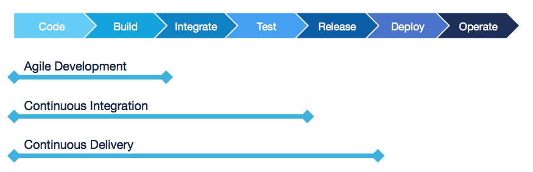

JENKINS FUNDAMENTALS
====================

Jenkins is #1 Continuous Integration and Delivery Server (CI-CD). +
Jenkins is the CD orchestrator. +
CloudBees enables enterprise to scale (__security__, __scalability__, __manageability__) Jenkins

=== 1. What is DevOps?

image::https://d1.awsstatic.com/product-marketing/DevOps/DevOps_feedback-diagram.ff668bfc299abada00b2dcbdc9ce2389bd3dce3f.png[]

*Value* is created when the output of the any SDLC methodology phase becomes tangible to the business/user. In the Software Delivery Life Cycle (SDLC) *value* is created in *two* places.  _*First*_, when the software is created (`development`) and _*Second*_, when the software is `delivered` to the customer and feedback received. +

image::https://3ovyg21t17l11k49tk1oma21-wpengine.netdna-ssl.com/wp-content/uploads/2015/02/mustafa.jpg[]

The following are DevOps best practices +
    >> `Continous Integration` +
    >> `Continuous Delivery` +
    >> `Microservices` +
    >> `Infrastructure as Code` +
    >> `Monitoring and Logging` +
    >> `Communication and Collaboration`

[qanda]
What is Continuous Integration?::
*Continuous integration* is a software development practice where developers regularly merge their code changes into a central repository, after which automated builds and tests are run. The key goals of continuous integration are to find and address bugs quicker, improve software quality, and reduce the time it takes to validate and release new software updates. +
What is Continuous Delivery?::
*Continuous delivery* is a software development practice where code changes are automatically built, tested, and prepared for a release to production. It expands upon continuous integration by deploying all code changes to a testing environment and/or a production environment after the build stage. When continuous delivery is implemented properly, developers will always have a deployment-ready build artifact that has passed through a standardized test process.

*Continuous Integration* is the frequent, automatic integration of code Automatically tests all new and modified code with the master code

=== 2. Jenkins - Continuous Workflow

After code development has been complete, following are the required activities +
1. Put the modified code into SCM +
2. Build the code +
3. Test the code +
4. Deploy the code +
5. Freeze the copy of deployed code +

Jenkins automatically performs all activities required to deliver your software

You specify how to build and test your software and when/where/how to deploy it

Use a tool such as Apache Maven, Gradle, npm, Apache Ant, or even make to define the specific actions required at each step

You define a Jenkins Pipeline to run each activity in the same order every time

Pipeline is glue for the activities defined

Do NOT code build actions directly in the Pipeline!

The Pipeline runs each time the code is modified
